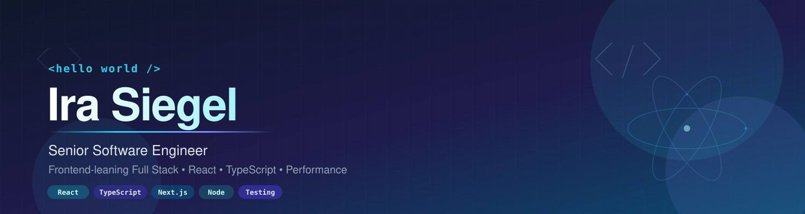

# Hi, I'm Ira! 👋

## 💻 Senior Software Engineer • Frontend-leaning Full Stack • React & TypeScript

I'm a Frontend-leaning Full Stack Engineer based in Phoenix, AZ, with a passion for building scalable, high-traffic web applications. Over the past several years I've worked on customer-facing experiences used by millions — from photo book creation flows to personalized e-commerce product pages — with a focus on React, TypeScript, and performance optimization.

I care about modular frontend architecture, observability, and shipping reliable user experiences across large-scale distributed systems. I believe great frontend engineering is equal parts craft and discipline: thoughtful architecture, comprehensive testing, and clean, maintainable code that other engineers actually enjoy working in.

---

## 🚀 What I'm Working On

- **Modern React patterns** — exploring the latest in React state management, server components, and architectural patterns that scale
- **Performance & observability** — deepening my work with Core Web Vitals, telemetry, and frontend monitoring tooling
- **Side projects** — building small apps to experiment with new ideas in TypeScript, Next.js, and testing strategies

---

## ✨ Core Skills

- Scalable React architecture and modular frontend systems
- TypeScript across large codebases
- Performance optimization (Core Web Vitals, code splitting, lazy loading, memoization)
- Comprehensive testing with Jest, Vitest, and Playwright
- Frontend observability and telemetry integration (Splunk, NRD)
- SEO and discoverability strategies (canonical tags, URL normalization)
- Mentoring engineers and leading Scrum ceremonies

---

## 🛠️ Tech Stack & Tools

### Languages & Frontend

### Frameworks & Runtime

### Testing

### Observability & Performance

### DevOps & Workflow

---

## 📈 A Few Highlights

- 📚 Led development of Shutterfly's **'Make My Book'** experience, driving **122%+ growth** in related sales
- 🎯 Partnered with Product on three phases of **PIP personalization**, driving revenue gains of up to **140%**
- 🧹 Modernized a legacy React codebase by consolidating multiple class-based apps into a unified function-based architecture, removing Redux in favor of modern React state management
- ⚡ Improved Core Web Vitals (CLS, LCP) through code splitting, lazy loading, and memoization
- 🧪 Stabilized a large-scale React app by expanding Jest test coverage, reducing recurring production defects

---

## 🤝 Let's Connect

Always happy to chat about React architecture, frontend performance, or building reliable systems at scale.

- 🌐 [Website](https://imsiegel.com)
- 💼 [LinkedIn](https://www.linkedin.com/in/irasiegel)
- ✉️ [ira@imsiegel.com](mailto:ira@imsiegel.com)
